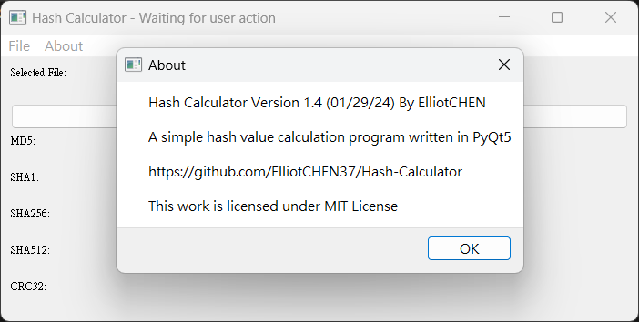

# Hash-Calculator
Hash Calculator made with Python

## IMPORTANT
Please note that in the latest version (1.4.1), you may encounter Windows Defender mistakenly identifying it as a "Trojan horse virus". Just unblock it. The software does not have any virus functions and is completely clean. If you still have concerns, you can check the software source code or build the executable file from the source code yourself to ensure security. I also promise not to plant any viruses into this project.

## Changelog
v1.4.1

-More shortcuts
-Check for update feature

v1.4

-New Export feature

## About
[LICENSE](LICENSE.txt)

## Sponsor
李涵博 $0.42 CNY

