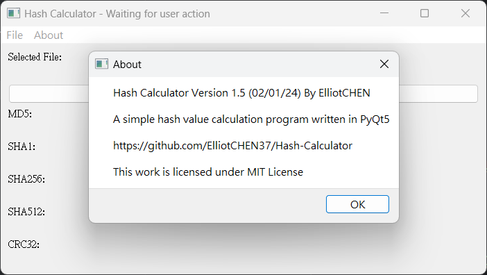

# Hash-Calculator 雜湊值計算器

A simple hash value calculation program written in PyQt5<br>
一個用PyQt5編寫的簡單雜湊值計算器

<table>
    <tr>
        <td>
            <a href="https://github.com/ElliotCHEN37/Hash-Calculator/releases/latest/download/Hash_Calculator_Windows.exe"></a>
        </td>
        <td>
            <a href="https://github.com/ElliotCHEN37/Hash-Calculator/releases/latest/download/Hash_Calculator_Windows_DEBUG.exe"></a>
        </td>
        <td>
            <a href="https://github.com/ElliotCHEN37/Hash-Calculator/releases/download/v1.5.1/Hash_Calculator_Windows_CLI.exe"></a>
        </td>
    </tr>
</table>



### Special Feature in v1.5+ 1.5及更高版本中的特殊功能

If there is a "hash_values.json" available in the working directory, Hash_Calculator will auto compare the results, and
change the color* of results in GUI windows.<br>
如果在工作目錄下有"hash_values.json"，那麼Hash_Calculator將會自動對比結果並且改變圖形化介面的結果顏色*<br>
*Green Texts: Matched, Red Texts: Didn't match 綠色字體：相符，紅色字體：不符<br>

### JSON file format JSON文件格式

```JSON
{
  "MD5": "<MD5VALUE, MD5值>",
  "SHA1": "<SHA1VALUE, SHA1值>",
  "SHA256": "<SHA256VALUE, SHA256值>",
  "SHA512": "<SHA512VALUE, SHA512值>",
  "CRC32": "<CRC32VALUE, CRC32值>"
}

```

<br>
Keys can be missing<br>
鍵可以缺失

## Build and Environment 構建以及環境

### Environment 環境

-Python 3<br>
-PyQt5<br>

1. Download Python 3 from <a href="https://www.python.org">www.python.org</a> and install it.<br>
   從<a href="https://www.python.org">www.python.org</a>下載並且安裝Python 3
2. Run `pip install pyqt5` in terminal or `pip install -r requirements.txt`<br>
   在終端中執行`pip install pyqt5`或者`pip install -r requirements.txt`

### Build for Windows 為Windows構建

#### PyQt5

1. Run`pip install pyinstaller` (If you installed pyinstaller, just skip it)<br>
   執行`pip install pyinstaller`（如果你已經安裝過，請跳過）<br>
2. Run`pyinstaller <path to main.py>`to create executable file<br>
   執行`pyinstaller <main.py的路徑>`來創建可執行文件<br>
   -Add`--onefile`if you want a single file version<br>
   如果你只想要組建單個可執行文件，請添加`--onefile`<br>
   -Add`--noconsole`if you want to hide the terminal<br>
   如果你想要隱藏終端窗口，請添加`--noconsole`

#### CLI Version 命令行版本 NO LONGER SUPPORT 不再支援

1. Run`pip install pyinstaller` (If you installed pyinstaller, just skip it)<br>
   執行`pip install pyinstaller`（如果你已經安裝過，請跳過）<br>
2. Run`pyinstaller <path to main.py>`to create executable file<br>
   執行`pyinstaller <main.py的路徑>`來創建可執行文件<br>
   -Add`--onefile`if you want a single file version<br>
   如果你只想要組建單個可執行文件，請添加`--onefile`<br>

## NEW FEATURES 新功能

### EXPORT 匯出 (v1.4)

You can use this function by pressing "Ctrl+S" or going to "File" -> "Export"<br>
你可以通過"Ctrl+S"或者前往"File" -> "Export"

### COMPARE 比較 (v1.5)

You can use this function by pressing "Ctrl+H" or going to "File" -> "Compare"<br>
你可以通過"Ctrl+H"或者前往"File" -> "Compare"

### DEBUG MODE 除錯模式 (v1.5.1)

To enable this function, download the "Hash_Calculator_Windows_DEBUG.exe" from latest release
如果想要啟用該功能，請從"Release"當中下載"Hash_Calculator_Windows_DEBUG.exe"

### ONLINE COMPARE 線上對比 (v1.5.5)

You can use this function by pressing "Ctrl+Alt+H" or going to "File" -> "Online Compare"<br>
你可以通過"Ctrl+Alt+H"或者前往"File" -> "Compare"

## Variants 變體

#### CLI (Command Line) Edition 命令行版本<br>

#### Usage 用法

1. Run the program directly. <br>
   直接執行程序
2. Run the program with argument in terminal. <br>
   在終端中以參數啟動程序<br>
   命令`Hash_Calculator_CLI.exe <file_path 文件路徑>`<br>

#### DEBUG EDITION 除錯版本

#### Usage 用法

As same as the standard version<br>
與標準版相同

## Changelog 更新日志

#### PyQt5 Edition PyQt5版本
v1.5.5<br>
New 新功能<br>
-Online Compare 線上對比

v1.5.4<br>
Fix 修復<br>
-Fix compare function 修復比較功能<br>
-Fix BUGs 修正程錯

v1.5.3<br>
Fix 修復<br>
-Fix compare logic 修復比較邏輯

v1.5.2<br>
New 新功能<br>
-New export format 新的匯出格式

v1.5.1<br>
Fix 修復<br>
-Changelog link 更新日誌連結<br>
New 新功能<br>
-Debug mode 除錯模式

v1.5<br>
New 新功能<br>
-Compare feature 比較功能<br>
-Redirect Changelog to here 將Changelog重新導向至此<br>
-New update message box for special situation 特殊情況下的更新對話框

v1.4.1<br>
New 新功能<br>
-More shortcuts 更多快速鍵<br>
-Check for update 檢查更新

v1.4<br>
New 新功能<BR>
-Export 匯出

#### CLI Edition 命令行版本 NO LONGER SUPPORT 不再支援

v1.0<br>
Initial Release 初版

## About 關於

[LICENSE 授權](LICENSE.txt)
